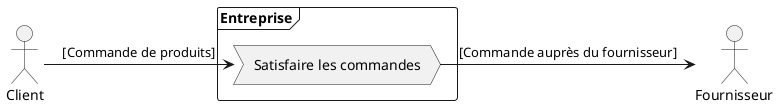
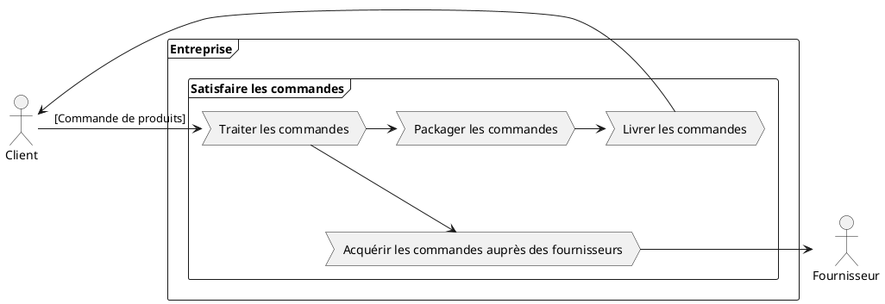
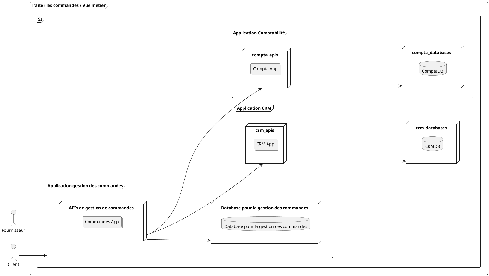

<!--
Rappels sur le système d'information
* Comment est défini et cartographié le système d'information
* Les différentes strates
-->

# Systèmes d'Informations (Rappels)
## Définition

> Le système d'information (SI) est un ensemble organisé de **ressources** qui permet de collecter, stocker, traiter et distribuer de l'information, en général grâce à un réseau d'ordinateurs. Il s'agit d'un système **socio-technique composé de deux sous-systèmes, l'un social et l'autre technique**. Le sous-système social est composé de la structure organisationnelle et des personnes liées au SI. Le sous-système technique est composé des technologies (hardware, software et équipements de télécommunication) et des processus d'affaires concernés par le SI.
>

Source: Wikipedia <mdi-wikipedia  />
---

## Enjeux
Les SI deviennent de plus en complexes 

Les causes :
* De plus en plus de contraintes réglementaires : GDPR, PCI DSS, OIV,...
* le métier et la concurrence
* Le cycle des technologies est de plus en plus rapide et difficile à maintenir
* La gestion du patrimoine de tout le matériel et des applications
* Les réductions budgétaires qui obligent de faire plus avec moins
 
---

## Et l'organisation dans tout ça ?

> « Toute organisation qui conçoit un système, au sens large, concevra une structure qui sera la copie de la structure de communication de l’organisation. »

- M. Conway

Le SI est bien trop souvent le reflet de l'organisation !

--- 

# L' urbanisation

L'urbanisation des SI est utile dans les grandes organisations pour maîtriser le patrimoine et ses évolutions.

Les concepts manipulés pour urbaniser le SI sont:
* La cartographie du SI avec le plan d'occupation des sols (POS)
* La définition des processus et activités
* La cartographie des processus

---

## Comment démarrer ?

L'urbanisation et la conception d'un SI se basent en premier lieu sur des lignes directrices données par le schéma directeur.

### Le schéma directeur

Il va donner la stratégie des différentes actions sur plusieurs années (ex. 5 ans).

* Il se base en premier lieu sur un audit de l'existant.
* Il définit ensuite les grands axes d'actions à réaliser ainsi que la stratégie à adopter

Exemple: le schéma directeur de la DSI de la région [Centre Val de Loire](https://www.viragegroup.com/ressources/exemple-schema-directeur-informatique-temoignage-de-la-dsi-region-centre-val-de-loire/).

---

### Un exemple de décision... et des conséquences

La direction générale a décidé de réagir très rapidement à l'ouverture du marché à la concurrence.

Les actions à mener sont:

* Centrer l'activité sur le client
* Uniformiser les organisations
* Identifier le client automatiquement lors d'un appel quelque soit l'endroit ou il se trouve

#### Les questions
* Quels sont les impacts sur le métier?
* Quels sont les impacts sur le système d'information?
* Quelles sont les innovations qui peuvent aider?

---

## Une vue métier
<v-clicks>

</v-clicks>
---

Différents domaines métier sont impactés:
* La logistique
* La vente
* Les canaux de vente (Web, Téléphonie)

---

## La traduction technique

## La cartographie et le POS

## Les différentes strates

