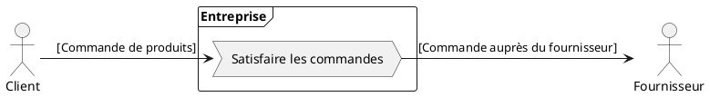
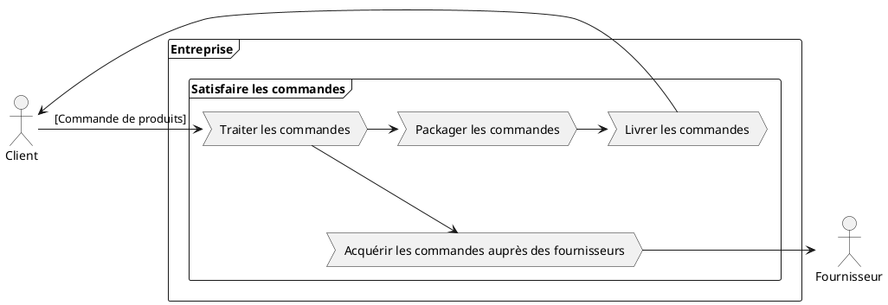
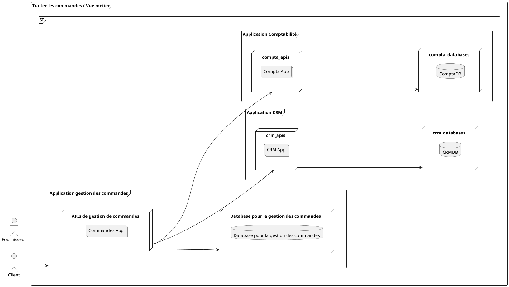

<!--
Rappels sur le système d'information
* Comment est défini et cartographié le système d'information
* Les différentes strates
-->

# Systèmes d'Informations (Rappels)
## Définition

> Le système d'information (SI) est un ensemble organisé de ressources qui permet de collecter, stocker, traiter et distribuer de l'information, en général grâce à un réseau d'ordinateurs. Il s'agit d'un système socio-technique composé de deux sous-systèmes, l'un social et l'autre technique. Le sous-système social est composé de la structure organisationnelle et des personnes liées au SI. 
>
>Le sous-système technique est composé des technologies (hardware, software et équipements de télécommunication) et des processus d'affaires concernés par le SI.
>

Source: <mdi-wikipedia  />ikipedia [@system-information-wikipedia]
---

## Enjeux
Les SI deviennent de plus en complexes. 

Les causes :
* De plus en plus de contraintes réglementaires : GDPR, PCI DSS, OIV,...
* le métier et la concurrence
* Le cycle des technologies est de plus en plus rapide et difficile à maintenir
* La gestion du patrimoine de tout le matériel et des applications
* Les réductions budgétaires qui obligent de faire plus avec moins
 
---

## Et l'organisation dans tout ça ?

> « Toute organisation qui conçoit un système, au sens large, concevra une structure qui sera la copie de la structure de communication de l’organisation. »

- M. Conway  [@connway-law]
<v-clicks>
<AutoFitText :max="100" :min="50" modelValue="Le SI est bien trop souvent le reflet de l'organisation ! 
"/>

</v-clicks>
--- 

# L' urbanisation

L'urbanisation des SI est utile dans les grandes organisations pour maîtriser le patrimoine et ses évolutions.

Les concepts manipulés pour urbaniser le SI sont:
* La cartographie du SI avec le plan d'occupation des sols (POS)
* La définition des processus et activités
* La cartographie des processus

---

## Comment démarrer ?

L'urbanisation et la conception d'un SI se basent en premier lieu sur des lignes directrices données par le schéma directeur.

### Le schéma directeur

Il va donner la stratégie des différentes actions sur plusieurs années (ex. 5 ans).

* Il se base en premier lieu sur un audit de l'existant.
* Il définit ensuite les grands axes d'actions à réaliser ainsi que la stratégie à adopter

Exemple: le schéma directeur de la DSI de la région [Centre Val de Loire](https://www.viragegroup.com/ressources/exemple-schema-directeur-informatique-temoignage-de-la-dsi-region-centre-val-de-loire/). [@schema-directeur-cvl]

---

### Un exemple de décision... et des conséquences

La direction générale a décidé de réagir très rapidement à l'ouverture du marché à la concurrence.

Les actions à mener sont:

* Centrer l'activité sur le client
* Uniformiser les organisations
* Identifier le client automatiquement lors d'un appel quelque soit l'endroit ou il se trouve

**Les questions**
* Quels sont les impacts sur le métier?
* Quels sont les impacts sur le système d'information?
* Quelles sont les innovations qui peuvent aider?

---

## Les différentes vues

Pour définir un SI on va s'appuyer sur différentes visions complémentaires:

--- 

### La vue métier

La vue métier se concentre sur les processus et les activités de l'entreprise. Elle décrit comment l'entreprise fonctionne, quels sont ses objectifs, et comment les différentes activités et processus s'articulent pour atteindre ces objectifs.

* Objectifs et Stratégies : Définition des objectifs de l'entreprise et des stratégies pour les atteindre.
* Processus Métier : Description des processus métier clés, de leur déroulement et des interactions entre eux.
* Rôles et Responsabilités : Identification des acteurs (humains ou systèmes) impliqués dans les processus métier et leurs responsabilités.
* Flux d'Information : Analyse des flux d'information nécessaires au bon fonctionnement des processus métier.

<v-clicks>

</v-clicks>

---

### La vue fonctionnelle

La vue fonctionnelle détaille les fonctions nécessaires pour supporter les processus métier. Elle décrit les services et fonctionnalités attendus des systèmes d'information pour répondre aux besoins métiers.

* Fonctions Métier : Décomposition des processus métier en fonctions ou services spécifiques.
* Cartographie des Fonctions : Organisation des fonctions en catégories ou domaines fonctionnels.
* Interactions Fonctionnelles : Définition des interactions et des dépendances entre les différentes fonctions.

<v-clicks>
 

</v-clicks>

---

### Dépendances et impacts des processus métier

Différents domaines métier sont impactés:
* La logistique
* La vente
* Les canaux de vente (Web, Téléphonie)

---

## La vue applicative

La vue applicative se concentre sur les applications et les systèmes informatiques qui implémentent les fonctions identifiées dans la vue fonctionnelle. Elle décrit comment les applications sont organisées, interconnectées et déployées pour supporter les processus métier.

* Applications et Modules : Inventaire des applications et modules logiciels utilisés.
* Architecture Applicative : Organisation des applications et des modules, y compris les interactions et les intégrations entre eux.
* Flux Applicatifs : Définition des flux de données et des interactions entre les applications.

---

## La vue technique

La vue technique se focalise sur les aspects technologiques et infrastructurels qui supportent les applications et les systèmes informatiques. Elle décrit les composants matériels et logiciels nécessaires à l'implémentation des applications.

* Infrastructure Technique : Description des composants matériels (serveurs, réseaux, stockage) et logiciels (systèmes d'exploitation, bases de données, middleware).
* Architecture Technique : Organisation de l'infrastructure technique et des technologies utilisées.
* Sécurité et Performance : Aspects relatifs à la sécurité, la résilience, et la performance des systèmes.

---

--- 

## En résumé

En résumé, les différentes vues en urbanisation permettent d'avoir une vision globale et structurée des systèmes d'information d'une entreprise. Elles facilitent la compréhension des relations et des dépendances entre les processus métier, les fonctions, les applications, et les infrastructures techniques, tout en aidant à identifier les zones d'amélioration et à planifier les évolutions futures.

---

## La cartographie et le Plan d'Occupation des Sols

La cartographie d'un système d'information s'appuie sur le Plan d'Occupation des Sols
