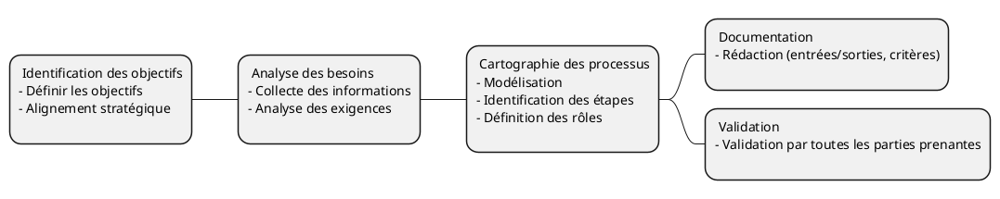

# Les processus métier
### Définition

Il s'agit d'un ensemble de tâches liées entre elles qui aboutissent à la prestation d'un service ou à la fourniture d'un produit à un client. Un processus métier est également un ensemble d'activités qui permettent d'atteindre un objectif organisationnel spécifique. 

Il doit comporter des entrées clairement définies et une sortie unique, dans le cadre d'un traitement de bout en bout piloté par les événements. Les entrées peuvent être classées en processus de gestion, opérationnels et de soutien.

---

## Méthodologie

<!-- 
1. Identification des Objectifs
Définir les objectifs : Clarifiez les objectifs du processus métier. Que souhaitez-vous accomplir ? Quels sont les résultats attendus ?
Alignement stratégique : Assurez-vous que les objectifs du processus sont alignés avec les objectifs stratégiques de l'organisation.
2. Analyse des Besoins
Collecte des informations : Recueillez des informations auprès des parties prenantes, y compris les utilisateurs finaux, les managers et les experts métier.
Analyse des exigences : Identifiez les exigences fonctionnelles et non fonctionnelles du processus.
3. Cartographie du Processus
Modélisation : Utilisez des outils de modélisation comme BPMN (Business Process Model and Notation) pour créer une représentation visuelle du processus.
Identification des étapes : Décomposez le processus en étapes ou activités distinctes.
Définition des rôles : Identifiez les rôles et les responsabilités de chaque acteur impliqué dans le processus.
4. Documentation
Rédaction des procédures : Documentez chaque étape du processus, y compris les entrées, les sorties, les critères de performance et les points de contrôle.
Création de manuels : Préparez des manuels ou des guides pour les utilisateurs finaux et les gestionnaires de processus.
-->

### Comment définir le périmètre d'un processus ?

Définissez clairement le périmètre du processus en identifiant le Qui, Quoi, Quand, Où et Pourquoi de votre processus (le Comment étant le processus lui-même).

---
layout: quote
---

## La norme Business Process Model and Notation (BPMN)

Business Process Model and Notation (BPMN en anglais), [...] est une méthode de modélisation de processus d'affaires pour décrire les chaînes de valeur et les activités métier d'une organisation sous forme d'une représentation graphique. Elle constitue la norme internationale ISO/CEI 195103. 

Source: Wikipedia [@bpmn-definition]

--- 

### Les éléments du langage

Plus de détails: [https://www.bpmn.org/](https://www.bpmn.org/)

<!-- 
En BPMN (Business Process Model and Notation), les concepts de "message" et de "sequence flow" sont utilisés pour représenter différentes formes de communication et de flux dans un processus métier. Voici les différences principales entre un message et un sequence flow :

### Message
- **Définition** : Un message représente la communication entre deux entités distinctes, généralement entre deux pools différents dans un diagramme BPMN.
- **Utilisation** : Les messages sont utilisés pour modéliser l'échange d'informations entre différents participants ou systèmes. Par exemple, l'envoi d'un email, une requête HTTP, ou un appel téléphonique.
- **Représentation** : Les messages sont représentés par une ligne en pointillés avec un cercle ouvert à une extrémité et une flèche à l'autre, souvent accompagnée d'une icône d'enveloppe.
- **Contexte** : Les messages traversent les frontières des pools, indiquant une interaction entre différents acteurs ou systèmes.

### Sequence Flow
- **Définition** : Un sequence flow représente l'ordre d'exécution des activités au sein d'un même pool ou processus.
- **Utilisation** : Les sequence flows sont utilisés pour modéliser la progression logique des tâches, événements et décisions dans un processus. Ils montrent comment une activité suit une autre.
- **Représentation** : Les sequence flows sont représentés par une ligne continue avec une flèche à une extrémité.
- **Contexte** : Les sequence flows ne traversent pas les frontières des pools. Ils sont utilisés pour montrer la séquence des activités à l'intérieur d'un même pool.

### Exemple Visuel
- **Message** : 
  - Pool A envoie un message à Pool B.
  - Représenté par une ligne en pointillés avec une enveloppe.
- **Sequence Flow** : 
  - Activité 1 est suivie par Activité 2 dans le même pool.
  - Représenté par une ligne continue avec une flèche.

### Résumé
- **Message** : Communication entre différents participants (pools).
- **Sequence Flow** : Ordre d'exécution des activités au sein d'un même participant (pool).

Ces distinctions sont essentielles pour modéliser correctement les processus métier et comprendre les interactions et les flux de travail dans un diagramme BPMN.
-->

--- 

## Un exemple

* [https://bpmn.io/toolkit/bpmn-js/examples/](https://bpmn.io/toolkit/bpmn-js/examples/)
* [https://www.inveskills.com/bpmn/bpmn-examples/](https://www.inveskills.com/bpmn/bpmn-examples/)
* [https://www.edrawsoft.com/bpmn-diagram-examples.html](https://www.edrawsoft.com/bpmn-diagram-examples.html)

---
layout: image-right
image: /logo-ISO-9001.png
backgroundSize: 100%
---

## Cartographie des processus

### Une norme

> Norme ISO 9001

La cartographie des processus métier selon la norme ISO 9001 consiste à 
* Identifier
* Documenter
* Analyser les processus clés d'une organisation 

---
layout: two-cols
---

### Objectifs de la Cartographie des Processus Métier selon ISO 9001

* Conformité
* Amélioration de la qualité
* Efficacité et efficience
* Transparence 
* Satisfaction des clients

::right::

### Avantages de la Cartographie des Processus Métier selon ISO 9001

* Clarté et compréhension 
* Amélioration continue 
* Conformité réglementaire
* Efficacité opérationnelle
* Engagement des employés
* Satisfaction des clients

<!-- 
### Objectifs de la Cartographie des Processus Métier selon ISO 9001
* Conformité : Assurer que les processus de l'organisation sont conformes aux exigences de la norme ISO 9001.
* Amélioration de la Qualité : Identifier les opportunités d'amélioration continue des processus pour augmenter la qualité des produits ou services.
* Efficacité et Efficience : Optimiser les processus pour réduire les gaspillages et améliorer l'efficacité opérationnelle.
* Transparence : Fournir une vue claire et compréhensible des processus pour tous les membres de l'organisation.
* Satisfaction des Clients : Améliorer la satisfaction des clients en garantissant que les processus répondent à leurs besoins et attentes.

### Avantages de la Cartographie des Processus Métier selon ISO 9001
* Clarté et Compréhension : Facilite la compréhension des processus par tous les membres de l'organisation.
* Amélioration Continue : Identifie les points faibles et les opportunités d'amélioration dans les processus.
* Conformité Réglementaire : Aide à garantir que les processus sont conformes aux exigences réglementaires et normatives.
* Efficacité Opérationnelle : Permet d'optimiser les processus pour réduire les coûts et améliorer l'efficacité.
* Engagement des Employés : Encourage la participation et l'engagement des employés dans l'amélioration des processus.
* Satisfaction des Clients : Contribue à améliorer la qualité des produits ou services, augmentant ainsi la satisfaction des clients.
-->

---
layout: image-right
image: /processus.svg
backgroundSize: 100%
---

## Exemple de cartographie de processus

### Contexte
Une entreprise de fabrication de pièces automobiles souhaite cartographier ses processus pour se conformer à la norme ISO 9001 et améliorer la qualité de ses produits.

### Étapes de la Cartographie
Identification des _"Macro"_ Processus Clés

* Processus de gestion des commandes
* Processus de production
* Processus de contrôle qualité
* Processus de gestion des fournisseurs
* Processus de gestion des retours clients
---

### Documentation des Macro Processus

* Processus de gestion des commandes : Réception de la commande, vérification des spécifications, planification de la production.
* Processus de production : Préparation des matières premières, fabrication, assemblage.
* Processus de contrôle qualité : Inspection des produits finis, tests de conformité, enregistrement des résultats.
* Processus de gestion des fournisseurs : Sélection des fournisseurs, évaluation des performances, gestion des contrats.
* Processus de gestion des retours clients : Réception des retours, analyse des causes, actions correctives.

> Chaque macro processus pourra être découpé en processus qui seront spécifiés et documentés

--- 

## Zoom sur le processus de gestion des commandes

Il est décomposé en un ou plusieurs sous processus.

Exemple:

