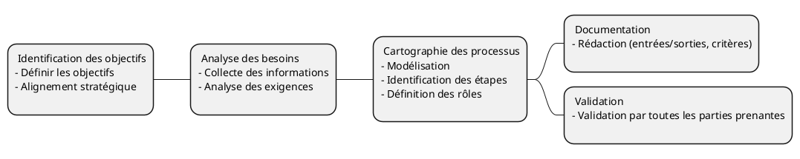

# Les processus métier
### Définition

Il s'agit d'un ensemble de tâches liées entre elles qui aboutissent à la prestation d'un service ou à la fourniture d'un produit à un client. Un processus métier est également un ensemble d'activités qui permettent d'atteindre un objectif organisationnel spécifique. 

Il doit comporter des entrées clairement définies et une sortie unique, dans le cadre d'un traitement de bout en bout piloté par les événements. Les entrées peuvent être classées en processus de gestion, opérationnels et de soutien.

---

## Méthodologie

<!-- 
1. Identification des Objectifs
Définir les objectifs : Clarifiez les objectifs du processus métier. Que souhaitez-vous accomplir ? Quels sont les résultats attendus ?
Alignement stratégique : Assurez-vous que les objectifs du processus sont alignés avec les objectifs stratégiques de l'organisation.
2. Analyse des Besoins
Collecte des informations : Recueillez des informations auprès des parties prenantes, y compris les utilisateurs finaux, les managers et les experts métier.
Analyse des exigences : Identifiez les exigences fonctionnelles et non fonctionnelles du processus.
3. Cartographie du Processus
Modélisation : Utilisez des outils de modélisation comme BPMN (Business Process Model and Notation) pour créer une représentation visuelle du processus.
Identification des étapes : Décomposez le processus en étapes ou activités distinctes.
Définition des rôles : Identifiez les rôles et les responsabilités de chaque acteur impliqué dans le processus.
4. Documentation
Rédaction des procédures : Documentez chaque étape du processus, y compris les entrées, les sorties, les critères de performance et les points de contrôle.
Création de manuels : Préparez des manuels ou des guides pour les utilisateurs finaux et les gestionnaires de processus.
-->

---

## La norme BPMN

## Un exemple

## Cartographie des processus

